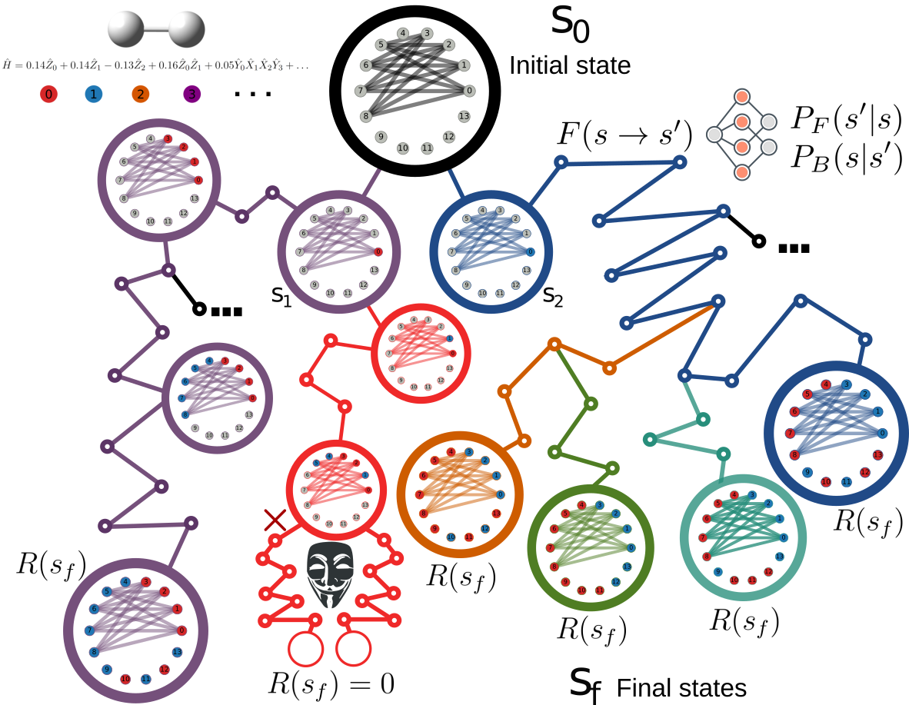

# Discrete Flow-Based Generative Models for Measurement Optimization in Quantum Computing [](https://arxiv.org/abs/2509.15486)

The purpose of this code is to generate groupings of molecular Hamiltonians for their implementation in Quantum Computers based on the number of measurements required to reach an accuracy $\varepsilon$ and the number of groups through a Generative Flow Networks (GFlowNets) based sampling.
GFlowNet generates different samples where the probability of reaching a final state in the trajectory is proportional to its reward.

After cloning, install the package as:
```
pip install -e .
```

Before you run make sure to have the proper packages installed in requirements.txt 
or
For most users, installing: matplotlib, seaborn, pennylane, openfermion, tequila-basic, pyscf, torch, and torch_geometric would be enough.




Reward functions can be
- ***color_reward*** based only on the number of colors.
- ***vqe_reward*** which contains the estimated number of measurements, used in https://arxiv.org/abs/2410.16041
- ***meas_reward*** which uses exact variances to get the measurement number and $\lambda_0=1$, $\lambda_1=1$ in the reward.
- ***my_reward*** which uses exact variances to get the measurement number and a $\lambda_0=10^3$ value
- ***custom_reward*** which uses exact variances to get the measurement number, and the user can pass the $\lambda_0$ and $\lambda_1$ values.
- ***covariance-based reward*** which precomputes a dictionary `Cov(P_j,P_k)` and evaluates grouped variances as
  `Var(H_alpha)=sum_{j,k in alpha} c_j c_k Cov(P_j,P_k)` (see `gflow_vqe/covariance_rewards.py`).

New objectives based on covariance rewards are available in `gflow_vqe/advanced_training.py`:
- `coeff_GIN_GAFN_training_cov_reward_state_vector` (intermediate-reward GAFN)
- `coeff_GIN_nablaDB_training_cov_reward_state_vector` (gradient-informed detailed balance)
- `coeff_GIN_GAFN_nablaDB_training_cov_reward_state_vector` (combined objective)

They can either build the covariance dictionary from `(graph, wfn, n_q)` or take a precomputed `CovarianceRewardData`.

Verify before running the reward function employed by the training protocol. The training functions are inside gflow_vqe/training.py. The list is available in the driver.py file with a small description of the models employed for each of them and the loss function implemented.

For the results of the paper ***"Discrete Flow-Based Generative Models for Measurement Optimization in Quantum Computing"***, we employed the training functions:
- ***GIN_TB_training*** corresponding to the $\texttt{GINE}$ model described in the text.
- ***coeff_GIN_TB_training*** corresponding to the $\texttt{GINE}_{w}$ model described in the text.
- ***coeff_GIN_TB_training_custom_reward***

All of them are using the  `my_reward` or `custom_reward` Reward functions. The upper bound for the search space is generated through a greedy coloring algorithm with a random sequential strategy and increased by +2

A mask function located in `gflow_vqe/gflow_utils.py` is employed to ensure that the generated graphs are valid and to limit the solution space. This limit can be changed by the user as required by employing the `coeff_GIN_TB_training_wbound` 

To generate a plot of commutativity graphs of the best-performing groupings, modify the driver.py file by calling 
`check_sampled_graphs_method_plot` instead of check_sampled_graphs_method. Lines are commented for user convenience. For method=fci, full CI variances are employed, while the vqe option uses only an estimator for them. This also outputs the best performing graphs according to `meas_reward`, and the valid graphs with the lowest measurement count. For ordering the graphs with respect to other reward functions (like the ones employed during training), we suggest taking the same function to a different file and modifying the reward according to the user's needs.

NN parameters and optimizer state are saved for each molecule in the .pth file.
All sampled graphs are saved as fig_name_sampled_graphs.p for data analysis or posterior use in quantum computing software.

To run the code, use:

```
python driver.py molecule > out.log
```

Where molecule can be $H_2$, $H_4$, $LiH$, $BeH_2$, $H_2O$, $N_2$. The default bond distance is 1 Å. This can be modified in the gflow_vqe/hamiltonians.py file. 

On driver.py, we can change parameters for GFlowNets like:
`fig_name`, Training rate, number of `hid_uinits`, number of episodes, embedding dimension, `update_freq` and the random seed. We leave options for GPU usage, although we saw no real benefit. 

Experimental! Parallel training implemented, we have multiple models (1/process) in the para driver and single-model versions where the updates occur on each processor or by collecting the results and updating outside the sampling parallel loop.


## Bibtex

```latex
@misc{gflownets_mopt:2025,
      title={Discrete Flow-Based Generative Models for Measurement Optimization in Quantum Computing}, 
      author={Isaac L. Huidobro-Meezs and Jun Dai and Rodrigo A. Vargas-Hernández},
      year={2025},
      eprint={2509.15486},
      archivePrefix={arXiv},
      primaryClass={quant-ph},
      url={https://arxiv.org/abs/2509.15486}, 
}
```
