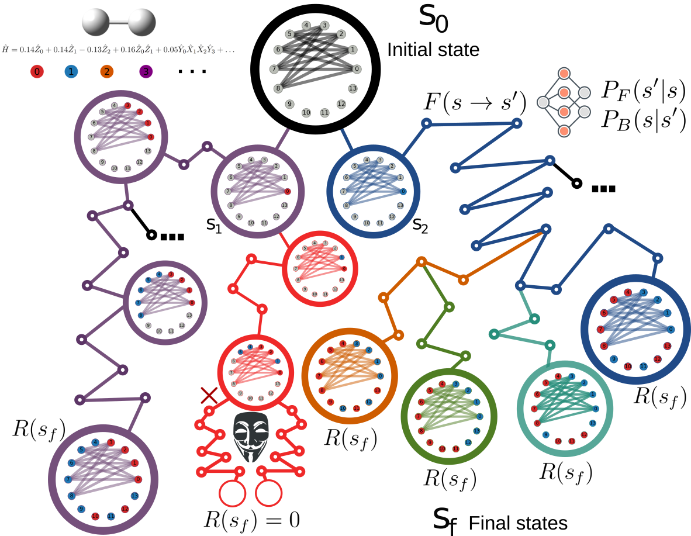

# Discrete Flow-Based Generative Models for Measurement Optimization in Quantum Computing [](https://arxiv.org/abs/2509.15486)

The purpose of this code is to generate groupings of molecular Hamiltonians for their implementation in Quantum Computers based on the number of measurements required to reach an accuracy $\varepsilon$ and the number of groups through a Generative Flow Networks (GFlowNets) based sampling.
GFlowNet generates different samples where the probability of reaching a final state in the trajectory is proportional to its reward.

After cloning, install the package as:
```
pip install -e .
```

Before you run make sure to have the proper packages installed in requirements.txt 
or
For most users, installing: pyscf openfermion matplotlib seaborn pennylane tequila-basic==1.9.9 torch torch_geometric would be enough. We require Setuptools<81




Reward functions can be
- ***color_reward*** based only on the number of colors.
- ***vqe_reward*** which contains the estimated number of measurements, used in https://arxiv.org/abs/2410.16041
- ***meas_reward*** which uses exact/CISD variances to get the measurement number and $\lambda_0=1$, $\lambda_1=1$ in the reward.
- ***my_reward*** which uses exact/CISD variances to get the measurement number and a $\lambda_0=10^3$ value
- ***custom_reward*** which combines three terms according to

```math
R(x) = \lambda_{0} R_M(x) + \lambda_{1} R_G(x) + \lambda_{2} R_{N_{2q}}(x)
```

  where

```math
R_M(x) = \frac{1}{\varepsilon^2 M(x)}
```

```math
\varepsilon^2 M(x) = \left( \sum_{\alpha=1}^{N_f} \sqrt{\mathrm{Var}(\hat{H}_\alpha)} \right)^2
```

```math
R_G(x) = N_P - N_G(x)
```

```math
R_{N_{2q}}(x) = \frac{1}{N_{2q}(x)}
```

  Here, $N_{2q}(x)$ is the total number of two-qubit gates required by the corresponding commuting-group measurement circuits.

For the $N_{2q}$ term, we generate commuting-group measurement circuits with Tequila and count the total number of two-qubit gates across all groups. The circuit synthesis follows the Tequila compilation pipeline and uses the linear reversible circuit synthesis method of Ketan N. Patel, Igor L. Markov, and John P. Hayes, "Optimal synthesis of linear reversible circuits," *Quantum Info. Comput.* **8**(3), 282-294 (2008).

Variance-based rewards can be evaluated with different wavefunctions. The library supports `FCI`, `HF`, and `CISD` wavefunctions for variance and reward calculations, so training can use exact variances or an approximate wavefunction such as CISD. Verify before running which reward function and which wavefunction are employed by the training protocol. The training functions are inside gflow_vqe/training.py. The list is available in the driver.py file with a small description of the models employed for each of them and the loss function implemented.

For the results of the paper ***"Discrete Flow-Based Generative Models for Measurement Optimization in Quantum Computing"***, we employed the training functions:
- ***GIN_TB_training*** corresponding to the $\texttt{GINE}$ model described in the text.
- ***coeff_GIN_TB_training*** corresponding to the $\texttt{GINE}_{w}$ model described in the text.
- ***coeff_GIN_TB_training_custom_reward***

All of them are using the `my_reward` or `custom_reward` reward functions. In the current implementation, `custom_reward` can mix measurement information, color reward, and Tequila-based two-qubit gate counts through the parameters `l0`, `l1`, and `l2`. The upper bound for the search space is generated through a greedy coloring algorithm with a random sequential strategy and increased by +2

A mask function located in `gflow_vqe/gflow_utils.py` is employed to ensure that the generated graphs are valid and to limit the solution space. This limit can be changed by the user as required by employing the `coeff_GIN_TB_training_wbound` 

To generate a plot of commutativity graphs of the best-performing groupings, modify the driver.py file by calling 
`check_sampled_graphs_method_plot` instead of check_sampled_graphs_method. Lines are commented for user convenience. For wavefunction-based analysis, the code can use `FCI`, `HF`, or `CISD` variances depending on the selected workflow, while still reporting the best-performing graphs and the valid graphs with the lowest measurement count. For ordering the graphs with respect to other reward functions (like the ones employed during training), we suggest taking the same function to a different file and modifying the reward according to the user's needs.

NN parameters and optimizer state are saved for each molecule in the .pth file.
All sampled graphs are saved as fig_name_sampled_graphs.p for data analysis or posterior use in quantum computing software.
The resulting groupings from the GFlowNet pipeline are non-overlapping groupings. Therefore, they can be used directly as initial points for overlapping measurement-allocation methods such as Iterative Coefficient Splitting (ICS) and Ghost Pauli products.

To run the code, use:

```
python driver.py molecule > out.log
```

Where molecule can be $H_2$, $H_4$, $LiH$, $BeH_2$, $H_2O$, $N_2$. The default bond distance is 1 Å. This can be modified in the gflow_vqe/hamiltonians.py file. 

On driver.py, we can change parameters for GFlowNets like:
`fig_name`, Training rate, number of `hid_uinits`, number of episodes, embedding dimension, `update_freq` and the random seed. We leave options for GPU usage, although we saw no real benefit. 

Experimental! Parallel training implemented, we have multiple models (1/process) in the para driver and single-model versions where the updates occur on each processor or by collecting the results and updating outside the sampling parallel loop.

To run the variance sanity check for a wavefunction on a deterministic greedy grouping, use:

```bash
python wfn_variance_check.py molecule
```

This uses `FCI` by default. You can also choose the wavefunction used for the variance/reward check with:

```bash
python wfn_variance_check.py molecule --wfn FCI
python wfn_variance_check.py molecule --wfn HF
python wfn_variance_check.py molecule --wfn CISD
```

For example:

```bash
python wfn_variance_check.py H2 --wfn HF
```

The script prints the selected molecule, the wavefunction method, the FCI and selected-wavefunction energies, the number of qubits and measurement groups, `eps^2 M` evaluated with both the selected wavefunction and FCI, and the first few grouped variances for comparison.

To compare sorted insertion, Tequila ICS, and ICS initialized from a GFlowNet-compatible grouping, use:

```bash
python GFlowICS.py molecule
```

You can also provide a specific sampled-graphs file:

```bash
python GFlowICS.py molecule --gflow-graphs molecule_sampled_graphs.p
```

Our ICS implementation is taken from the Tequila library and adapted to be compatible with the graph/coloring format used by the GFlowNet pipeline in this repository. If no sampled-graphs file is found, `GFlowICS.py` falls back to a greedy largest-first coloring written in the same graph format used by our algorithm.


## Bibtex

```latex
@misc{gflownets_mopt:2025,
      title={Discrete Flow-Based Generative Models for Measurement Optimization in Quantum Computing}, 
      author={Isaac L. Huidobro-Meezs and Jun Dai and Rodrigo A. Vargas-Hernández},
      year={2025},
      eprint={2509.15486},
      archivePrefix={arXiv},
      primaryClass={quant-ph},
      url={https://arxiv.org/abs/2509.15486}, 
}
```
